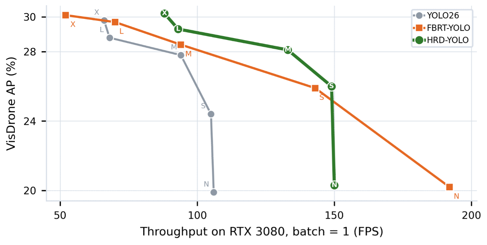
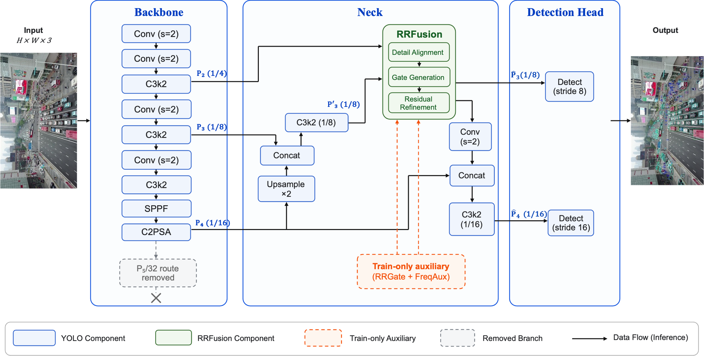
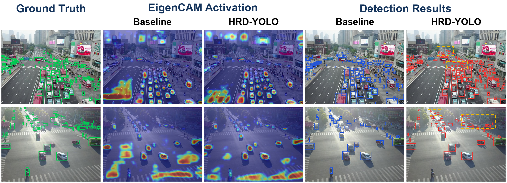

# HRD-YOLO

### High-Resolution Detail Reallocation for Real-Time Object Detection in Low-Altitude UAV Imagery

Official PyTorch implementation of **HRD-YOLO**.

<p align="center">
  
</p>

## Overview

We propose HRD-YOLO, a high-resolution detail reallocation method for real-time object detection in low-altitude UAV imagery.

<p align="center">
  
</p>

## Quick Start

```bash
# Environment Configuration
cd HRD-YOLO
pip install -e .
# Training：yolo26s example
yolo detect train data=VisDrone.yaml model=yolo26s.yaml epochs=300 imgsz=640 batch=4 optimizer=MuSGD lr0=0.01 momentum=0.937 weight_decay=0.0005 device=0 
# Validation
yolo val model=/absolute/path/to/weights/best.pt data=VisDrone.yaml imgsz=640 device=0 end2end=False
```

## Yaml preparation

Data: see [VisDrone.yaml](ultralytics/cfg/datasets/VisDrone.yaml)、[UAVDT.yaml](ultralytics/cfg/datasets/UAVDT.yaml)

Model: see [ultralytics/cfg/models/26/...](ultralytics/cfg/models/26/)

## Performance

### Accuracy, Complexity, and Throughput of the YOLO26, FBRT-YOLO, and HRD-YOLO Model Families on VisDrone

| **Model**   | **AP**   | **AP50** | **FLOPs**   | **Params**  | **FPS** |
| ----------- | -------- | -------- | ----------- | ----------- | ------- |
| YOLO26-N    | 19.9     | 34.5     | 5.2 G       | 2.5 M       | 106     |
| FBRT-YOLO-N | 20.2     | 34.4     | 6.7 G       | 0.9 M       | 192     |
| HRD-YOLO-N  | **20.3** | **35.4** | **4.2  G**  | **0.7  M**  | 150     |
| YOLO26-S    | 24.4     | 41.1     | 20.5 G      | 9.9 M       | 105     |
| FBRT-YOLO-S | 25.9     | 42.4     | 22.9 G      | 2.9 M       | 143     |
| HRD-YOLO-S  | **26.0** | **43.2** | **16.5  G** | 2.9 M       | **149** |
| YOLO26-M    | 27.8     | 45.9     | 67.9 G      | 21.8 M      | 94      |
| FBRT-YOLO-M | 28.4     | 45.9     | 58.7 G      | 7.2 M       | 94      |
| HRD-YOLO-M  | 28.1     | **46.6** | 66.5 G      | 11.5 M      | **133** |
| YOLO26-L    | 28.8     | 47.3     | 86.1 G      | 26.2 M      | 68      |
| FBRT-YOLO-L | 29.7     | 47.7     | 119.2  G    | 14.6 M      | 70      |
| HRD-YOLO-L  | 29.3     | **47.9** | **82.4  G** | **14.2  M** | **93**  |
| YOLO26-X    | 29.8     | 48.7     | 193.4  G    | 58.8 M      | 66      |
| FBRT-YOLO-X | 30.1     | 48.4     | 185.8  G    | 22.8 M      | 52      |
| HRD-YOLO-X  | **30.2** | **49.0** | **185.0 G** | 31.8 M      | **88**  |

### Detection Accuracy Compared With Representative Aerial Image Detectors on VisDrone

| **Method**   | **AP**   | **AP50** | **AP75** |
| ------------ | -------- | -------- | -------- |
| DMNet        | 29.4     | 49.3     | 30.6     |
| QueryDet     | 28.3     | 48.1     | 28.8     |
| CEASC        | 28.7     | 50.7     | 28.4     |
| YOLC-R50     | 28.9     | 51.4     | 28.3     |
| FBRT-YOLO-X  | 30.1     | 48.4     | 31.7     |
| UAV-DETR-R18 | 29.8     | 48.8     | —        |
| HRD-YOLO-X   | **30.2** | 49.0     | 30.9     |

### Detection Accuracy on UAVDT

| **Method**  | **AP**   | **AP50** | **AP75** |
| ----------- | -------- | -------- | -------- |
| ClusDet     | 13.7     | 26.5     | 12.5     |
| GLSAN       | 17.0     | 28.1     | 18.8     |
| DREN        | 15.1     | —        | —        |
| GFL         | 16.9     | 29.5     | 17.9     |
| CEASC       | 17.1     | 30.9     | 17.8     |
| FBRT-YOLO-X | 18.4     | 31.1     | 18.9     |
| YOLO26-X    | 21.6     | 33.8     | 24.4     |
| HRD-YOLO-X  | **23.0** | 35.5     | 25.6     |

### **Progressive Ablation Results for HRD-YOLO-S**

| **Configuration**      | **AP**     | **AP50**   | **AP75**   | **GFLOPs** | **Params (M)** |
| ---------------------- | ---------- | ---------- | ---------- | ---------- | -------------- |
| YOLO26-S               | 24.392     | 41.139     | 24.482     | 20.5       | 9.9            |
| + *P*5 removal         | 24.603     | 41.289     | 24.882     | 14.8       | 2.7            |
| + Direct  injection    | 24.907     | 42.272     | 25.053     | 15.9       | 2.8            |
| + Main  gate           | 25.123     | 42.219     | 25.462     | 16.5       | 2.9            |
| + RRGate               | 25.326     | 42.770     | 25.349     | 16.5       | 2.9            |
| + FreqAux  (zero cues) | 25.873     | 43.080     | 26.115     | 16.5       | 2.9            |
| HRD-YOLO-S (Full)      | **25.997** | **43.174** | **26.450** | 16.5       | 2.9            |

### Visualization

<p align="center">
  
</p>

## Acknowledgement

The code base is built with [ultralytics](https://github.com/ultralytics/ultralytics).

Thanks for the great implementations!
